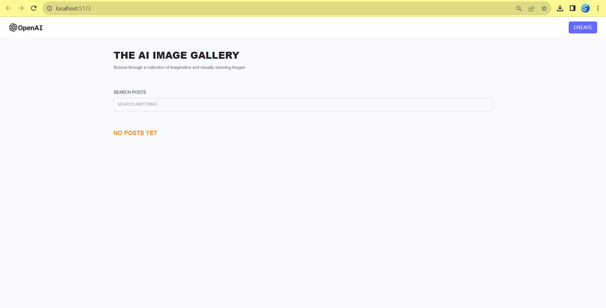
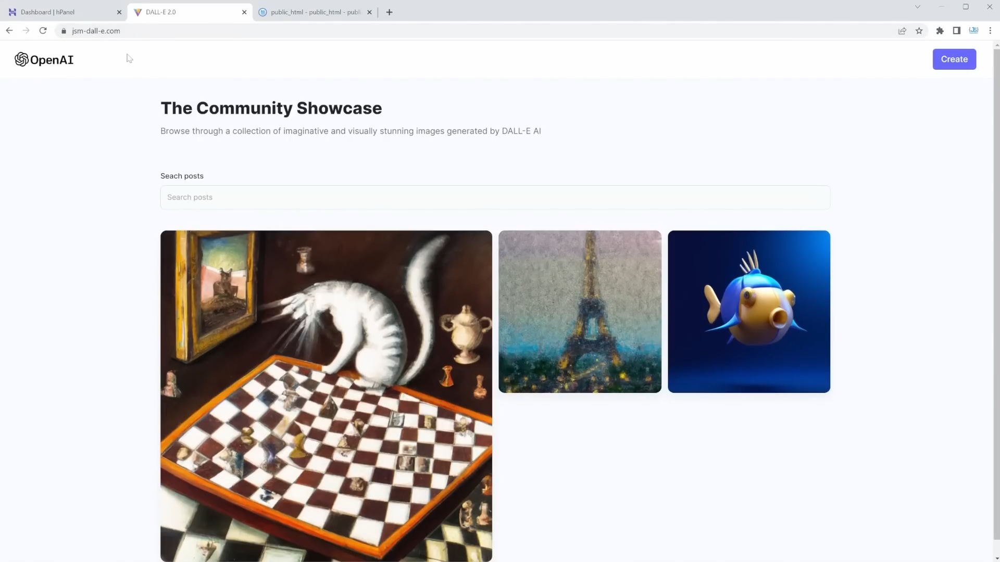

# DALL - E 2.0 
### AN AI WEB-BASED IMAGE GENERATING TOOL 

#### In an age where technology continues to push the boundaries of human creativity and innovation, the advent of artificial intelligence (AI) has become a transformative force in various industries. One such marvel of AI technology is DALL-E, a cutting-edge neural network developed by OpenAI, which is redefining the way we think about image generation. Our project, the AI Image Generating Web Application, harnesses the power of DALL-E to provide a revolutionary platform that empowers users to create stunning and imaginative images like never before.

#### DALL-E, introduced by OpenAI, is a remarkable AI model that combines the power of GPT-3's text generation with the ability to generate images from textual descriptions. This groundbreaking technology allows us to bridge the gap between language and visual art, enabling users to dream up, describe, and visualize images that were once limited by traditional graphic design tools.


## BADGES

[](https://choosealicense.com/licenses/mit/)

[](https://opensource.org/licenses/)

[](http://www.gnu.org/licenses/agpl-3.0)

## TOOLS IN USE 
##### FRONTEND
- REACTJS
- TAILWIND CSS

##### BACKEND
- NODEJS
- EXPRESSJS
- MONGODB


## API REFERENCE 

#### OPEN - AI & DALL -E 

| PARAMETER | TYPE     | DESCRIPTION                |
| :-------- | :------- | :------------------------- |
| `api_key` | `STRING` | **DALL-E API KEY** |

#### MONGOOSE 


| PARAMETER  | TYPE     | DESCRIPTION                       |
| :-------- | :------- | :-------------------------------- |
| `db_api_key`      | `STRING` | **DB CONNECTION** |

#### CLOUDINARY 

| PARAMETER  | TYPE     | DESCRIPTION                       |
| :-------- | :------- | :-------------------------------- |
| `cloudinary_api_key`      | `STRING` | **API-KEY** |
| `secret_key`      | `STRING` | **SECRET-KEY** |
| `cloudinary_cloud_name`      | `STRING` | **CLOUD NAME** |


## PORJECT DEPLOYMENT PROCEDURE

#### STEP 1 : git clone 

```bash
git clone https://github.com/SUVAJITKARMAKAR/AI-IMAGE-GENERATION-MERN-PROJECT.git
```

#### STEP 2 : install vite package manager deployment environment

```bash
npm create vite@latest 
```

#### STEP 3 : install tailwind css framework

```bash
npm install -D tailwindcss
npx tailwindcss init
```

#### STEP 4 : install the backend dependencies

```bash
npm install init -y
```

#### STEP 5 : modify your .env file along with your credentials

#### STEP 6 : run the following commands to start the server

```bash
cd ./main
cd ./frontend
npm run dev
```

```bash
cd ./main
cd ./backend
npm start
```

## PROJECT SCREENSHOT





## KEY FEATURES OF THIS APPLICATION 

- Intuitive and user centric interface
- AI driven called-to-serve image generation
- Freedom of creativity 
- Easy one click download and share


## OUR TEAM

- [@SUVAJIT KARMAKAR](https://github.com/SUVAJITKARMAKAR)

- [@HRISHABH GAUTAM](https://github.com/hrishabh-16)

- [@MANOSWITA BOSE](https://github.com/manoswita2501)